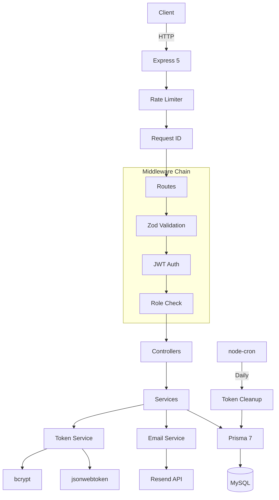
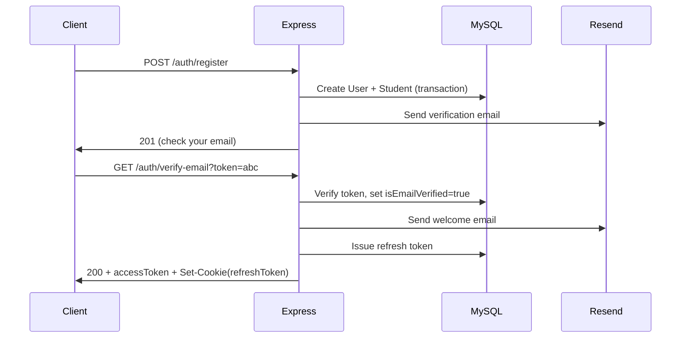
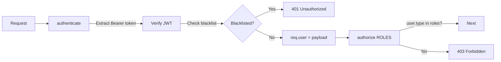

# Monash College Management System — Full Implementation Plan

## Architecture Overview




## New File Structure

```
src/
├── app.ts                          (update: add cookie-parser, rate limit, request-id)
├── server.ts                       (update: start cron job)
├── config/
│   ├── db.ts                       (keep)
│   ├── env.ts                      (update: add JWT, Resend env vars)
│   ├── multer.ts                   (update: date-based upload paths)
│   └── resend.ts                   (NEW)
├── controllers/
│   ├── auth.controller.ts          (NEW — register, login, refresh, logout, verify, reset)
│   ├── me.controller.ts            (NEW — self-service for all roles)
│   ├── students.controller.ts      (REWRITE)
│   ├── courses.controller.ts       (REWRITE)
│   ├── lecturers.controller.ts     (NEW)
│   ├── headLecturers.controller.ts (NEW)
│   ├── documents.controller.ts     (REWRITE from uploads.controller.ts)
│   └── utility.controller.ts       (NEW — enums, stats)
├── middleware/
│   ├── auth.middleware.ts           (NEW — authenticate + authorize)
│   ├── errorHandler.middleware.ts   (update: account locked 423, rate limit 429)
│   ├── rateLimit.middleware.ts      (NEW)
│   ├── requestId.middleware.ts      (NEW)
│   └── validateZod.middleware.ts    (update: return ALL errors)
├── routes/
│   ├── index.ts                    (REWRITE — mount all sub-routers)
│   ├── auth.routes.ts              (NEW)
│   ├── me.routes.ts                (NEW)
│   ├── students.routes.ts          (REWRITE)
│   ├── courses.routes.ts           (REWRITE)
│   ├── lecturers.routes.ts         (NEW)
│   ├── headLecturers.routes.ts     (NEW)
│   └── documents.routes.ts         (REWRITE from uploads.routes.ts)
├── services/
│   ├── auth.service.ts             (NEW — register, login, verify, reset, password)
│   ├── token.service.ts            (NEW — JWT sign/verify, blacklist, refresh)
│   ├── email.service.ts            (NEW — Resend integration, templates)
│   ├── students.service.ts         (REWRITE)
│   ├── courses.service.ts          (REWRITE)
│   ├── lecturers.service.ts        (NEW)
│   ├── headLecturers.service.ts    (NEW)
│   └── documents.service.ts        (REWRITE from uploads.service.ts)
├── utils/
│   ├── AppError.ts                 (update: errors array with field+message)
│   ├── logger.ts                   (keep)
│   ├── pagination.ts               (NEW — shared meta+links builder)
│   ├── prismaErrors.ts             (keep)
│   └── response.ts                 (update: support new error format)
├── validations/
│   ├── authValidation.ts           (NEW)
│   ├── profileValidation.ts        (NEW)
│   ├── studentValidation.ts        (REWRITE)
│   ├── courseValidation.ts         (REWRITE)
│   ├── lecturerValidation.ts       (NEW)
│   ├── headLecturerValidation.ts   (NEW)
│   ├── documentValidation.ts       (REWRITE from uploadValidation.ts)
│   └── paginationSchema.ts         (update: add search, sort, filter params)
└── jobs/
    └── tokenCleanup.ts             (NEW — daily cron to purge expired blacklisted tokens)
```

## Implementation Order

### Step 1: Packages and Config

Install new dependencies:

```bash
npm install express-rate-limit cookie-parser jsonwebtoken bcrypt resend node-cron
npm install -D @types/jsonwebtoken @types/bcrypt @types/cookie-parser @types/node-cron
```

Update `[.env.example](.env.example)` and `[.env](.env)` with new vars:

- `JWT_ACCESS_SECRET`, `JWT_REFRESH_SECRET`, `JWT_ACCESS_EXPIRES`, `JWT_REFRESH_EXPIRES`
- `RESEND_API_KEY`, `FROM_EMAIL`, `APP_URL`

Update `[src/config/env.ts](src/config/env.ts)` — add new env vars to Zod schema.

### Step 2: Prisma Schema

Replace `[prisma/schema.prisma](prisma/schema.prisma)` with the full schema from the plan (User, Profile, Student, Lecturer, HeadLecturer, Course, Document, TokenBlacklist + all enums). Key changes:

- Student/Lecturer/HeadLecturer now link to User via `userId`
- Document has optional FK relations to Student/Lecturer/HeadLecturer
- `fileSize` becomes `BigInt`, adds `fileUrl` field
- Course gains `description`, `isActive`
- New `TokenBlacklist` model

Run `npx prisma db push --force-reset` then `npx prisma generate`.

### Step 3: Core Utilities

- `**utils/AppError.ts**` — update `ErrorDetail` type to `{ field: string; message: string }`
- `**utils/response.ts**` — update to include `meta` and `links` in success responses, `errors` array with field+message in error responses
- `**utils/pagination.ts**` — NEW: shared helper that takes `(req, page, limit, total)` and returns `{ meta, links }` with `hasNext`, `hasPrev`, and full URL links
- `**middleware/validateZod.middleware.ts**` — change to collect ALL Zod issues and return them as `errors: [{ field, message }]` array
- `**middleware/requestId.middleware.ts**` — NEW: generates `crypto.randomUUID()`, sets `x-request-id` header
- `**middleware/rateLimit.middleware.ts**` — NEW: exports `authLimiter` (10 req/15min for auth routes) and `apiLimiter` (100 req/15min general)

### Step 4: Auth Infrastructure

- `**services/token.service.ts**` — NEW:
  - `signAccessToken(payload)` / `signRefreshToken(payload)` using jsonwebtoken
  - `verifyAccessToken(token)` / `verifyRefreshToken(token)`
  - `blacklistToken(token, expiresAt)` — insert into TokenBlacklist
  - `isTokenBlacklisted(token)` — check TokenBlacklist
  - `setRefreshCookie(res, token)` / `clearRefreshCookie(res)` — httpOnly cookie helpers
- `**middleware/auth.middleware.ts**` — NEW:
  - `authenticate` — extract Bearer token, verify, check blacklist, attach `req.user`
  - `authorize(...roles: UserType[])` — check `req.user.type` against allowed roles
  - `requireVerifiedEmail` — check `req.user.isEmailVerified`
- `**config/resend.ts**` — NEW: Resend client instance
- `**services/email.service.ts**` — NEW:
  - `sendVerificationEmail(email, name, token)`
  - `sendPasswordResetEmail(email, name, token)`
  - `sendWelcomeEmail(email, name)`
  - HTML templates with Monash branding (#003087)
  - In dev: also logs the URL to console

### Step 5: Auth Endpoints

- `**services/auth.service.ts**` — NEW: register, login, refreshToken, logout, verifyEmail, resendVerification, forgotPassword, resetPassword, getMe, updateMe, updateProfile, changePassword
  - Registration: hash password with bcrypt(12), create User + role entity (Student/Lecturer based on number prefix), generate email verify token, send verification email
  - Login: check email, verify password, check account lock (5 attempts / 15min lockout), update lastLoginAt, issue tokens
  - Account lockout: increment `failedLoginAttempts`, set `lockedUntil` after 5 failures
- `**validations/authValidation.ts**` — NEW: register, login, resetPassword, changePassword schemas. Password requires 8+ chars, uppercase, lowercase, digit, special char.
- `**validations/profileValidation.ts**` — NEW: profile update schema (phone, gender, race, dob, address fields)
- `**controllers/auth.controller.ts**` — NEW: thin controllers calling auth.service
- `**routes/auth.routes.ts**` — NEW: all `/auth/*` routes

### Step 6: Entity CRUD (Students, Courses, Lecturers, Head Lecturers)

All entity services follow the same pattern:

- `getAll(page, limit, filters)` — paginated list with search, sort, filter
- `getById(id)` — single entity with includes
- `create(data)` — create User + entity in transaction
- `update(id, data)` — partial update
- `remove(id)` — delete (or soft-delete User)

**Students** — rewrite `[src/services/students.service.ts](src/services/students.service.ts)`:

- `getAll` includes User, Profile, Course; supports `?search=&gender=&courseCode=&sortBy=&order=`
- `create` creates User(type=STUDENT) + Student in a `prisma.$transaction`
- Response shape matches plan (student + user + profile + course)

**Courses** — rewrite `[src/services/courses.service.ts](src/services/courses.service.ts)`:

- Add `description`, `isActive` fields
- `getAll` includes `_count` for totalStudents/totalLecturers
- `getById` includes lecturers list

**Lecturers** — NEW `src/services/lecturers.service.ts`: same pattern as students but for Lecturer entity

**Head Lecturers** — NEW `src/services/headLecturers.service.ts`: same pattern, no courseId

### Step 7: Self-Service `/me` Endpoints

- `**controllers/me.controller.ts`** — NEW:
  - `GET /me/student` — student's own data (STUDENT only)
  - `PATCH /me/student` — update own student data
  - `GET /me/course` — student's course
  - `GET /me/lecturer` — lecturer's own data (LECTURER only)
  - `PATCH /me/lecturer` — update own lecturer data
  - `GET /me/students` — students in lecturer's course (LECTURER only)
  - `GET /me/documents` — own documents (all roles)
  - `POST /me/documents` — upload own document (all roles)
- `**routes/me.routes.ts`** — NEW: all `/me/*` routes, all require `authenticate`

### Step 8: Documents

Rewrite the uploads module as documents:

- `**services/documents.service.ts`** — REWRITE: handles all entity types (Student, Lecturer, HeadLecturer)
- `**controllers/documents.controller.ts**` — REWRITE: entity-specific upload/list + generic delete
- `**routes/documents.routes.ts**` — REWRITE: routes for all 3 entity types + DELETE
- Update multer to use date-based paths: `uploads/YYYY/MM/DD/uuid.ext`
- Store both `filePath` (relative) and `fileUrl` (full URL) in DB

### Step 9: Utility Endpoints

- `**controllers/utility.controller.ts**` — NEW:
  - `GET /enums` — return all enum values (public or authenticated)
  - `GET /stats` — return counts + studentsByCourse + recentRegistrations (LECTURER + HEAD_LECTURER)
- Update `GET /health` response to match plan format
- Update `GET /` welcome response

### Step 10: Cron Job and Final Wiring

- `**jobs/tokenCleanup.ts**` — NEW: `node-cron` daily job that deletes expired rows from `token_blacklist`
- `**src/server.ts**` — import and start the cron job
- `**src/app.ts**` — wire everything: cookie-parser, rate limiters, request-id middleware, all route mounts
- `**routes/index.ts**` — mount all sub-routers with correct prefixes and middleware

### Step 11: Delete Old Files

Remove files that are replaced:

- `src/controllers/uploads.controller.ts` (replaced by `documents.controller.ts`)
- `src/services/uploads.service.ts` (replaced by `documents.service.ts`)
- `src/routes/uploads.routes.ts` (replaced by `documents.routes.ts`)
- `src/validations/uploadValidation.ts` (replaced by `documentValidation.ts`)

## Key Patterns

**Registration flow:**




**Auth middleware chain:**




**Pagination response builder** (`utils/pagination.ts`):

- Input: `(req, page, limit, total)`
- Output: `{ meta: { page, limit, total, totalPages, hasNext, hasPrev }, links: { self, next, prev, first, last } }`
- Links are built from `req.baseUrl + req.path` with query params

## Estimated File Count

- **New files:** ~25
- **Rewritten files:** ~12
- **Updated files:** ~8
- **Deleted files:** 4

